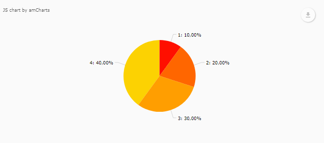
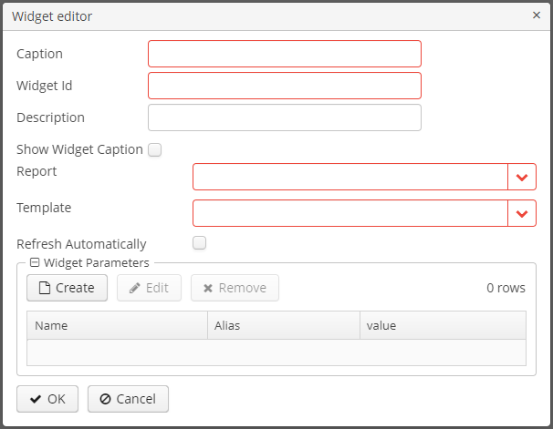

# Dashboard Chart Add-on

This add-on provides an additional chart widget for [Dashboards Add-on](https://github.com/cuba-platform/dashboard-addon).
The component enables creating a chart widget using data from reports. You can configure charts as reports in the report editor.

# Installation

Before installation the add-on install *Dashboards* add-on following the [installation instructions](https://github.com/cuba-platform/dashboard-addon#2-installation-).

The *Dashboard Chart* add-on can be added to your project in one of the ways described below. Installation from the Marketplace is the simplest way. The last version of the add-on compatible with the used version of the platform will be installed.
Also, you can install the add-on by coordinates choosing the required version of the add-on from the table.

In case you want to install the add-on by manual editing or by building from sources see the complete add-ons installation guide in [CUBA Platform documentation](https://doc.cuba-platform.com/manual-latest/manual.html#app_components_usage).

## From the Marketplace

1. Open your application in CUBA Studio. Check the latest version of CUBA Studio on the [CUBA Platform site](https://www.cuba-platform.com/download/previous-studio/).
2. Go to *CUBA -> Marketplace* in the main menu.

 

3. Find the Dashboard Chart add-on there.

 

4. Click *Install* and apply the changes.
The add-on corresponding to the used platform version will be installed.

## By coordinates

1. Open your application in CUBA Studio. Check the latest version of CUBA Studio on the [CUBA Platform site](https://www.cuba-platform.com/download/previous-studio/).
2. Go to *CUBA -> Marketplace* in the main menu.
3. Click the icon in the upper-right corner.

 

4. Paste the add-on coordinates in the corresponding field as follows:

 `com.haulmont.addon.dashboardchart:dashboardchart-global:<add-on version>`

 where `<add-on version>` is compatible with the used version of the CUBA platform.

 | Platform Version | Add-on Version |
|------------------|----------------|
| 7.2.X            | 1.3.0             |
| 7.1.X            | 1.2.0             |
| 7.0.X            | 1.1.0             |
| 6.10.X           | 1.0.0             |

5. Click *Install* and apply the changes. The add-on will be installed to your project.

# Usage

Component provides a chart widget for dashboards. A chart can be configured as a  report in *Reports browser*.

## Available Widget Settings:

- **Report** - a report which contains a chart template.
- **Template** - a chart template.
- **Refresh automatically** - if checked then a chart will be updated automatically on dashboard update.
